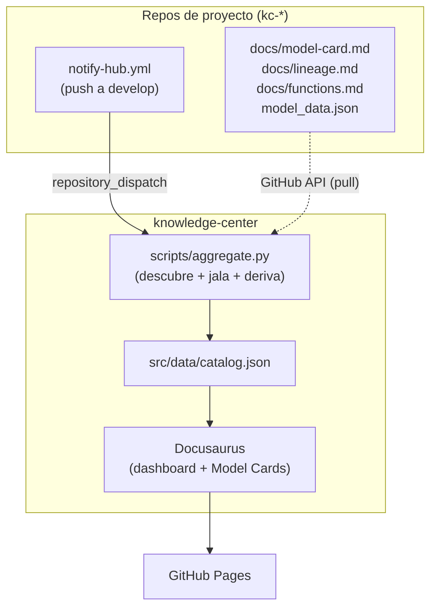

# Knowledge Center

Dashboard + documentación viva de los repos de modelos del COE. Descubre repos automáticamente,
jala su documentación fresca en cada build, y publica un sitio estático (Docusaurus) con un mapa
navegable, filtros, semáforo de estado y el Model Card de cada proyecto.

**En vivo:** https://luxitoppsai.github.io/knowledge-center/

## La idea en un párrafo

Este repo **no almacena documentación**. Es una **vista computada**: en cada build, descubre los
repos de proyecto (por prefijo `kc-*`), lee lo que tienen *ahora mismo* (qué archivos de doc
existen, si tienen releases, qué dice su `model_data.json`), arma el catálogo, y publica. Nada se
copia de forma permanente ni queda desactualizado — el build de mañana refleja el estado de mañana.
Ver [`RFC.md`](RFC.md) del proyecto para el contrato completo y la bitácora de decisiones.

## El ecosistema (4 repos)

| Repo | Rol | ¿Obligatorio? |
| --- | --- | --- |
| **`knowledge-center`** (este) | Agregación + dashboard + Pages | ✅ Sí — es el único que hace trabajo |
| [`knowledge-center-template`](https://github.com/luxitoppsai/knowledge-center-template) | Cookiecutter: de acá nace cada repo de proyecto | Conveniencia |
| [`knowledge-center-dispatcher`](https://github.com/luxitoppsai/knowledge-center-dispatcher) | Issue → repo nuevo | Conveniencia |
| [`knowledge-center-autodoc`](https://github.com/luxitoppsai/knowledge-center-autodoc) | Skill que genera el Model Card | Conveniencia |

Un repo de proyecto **no necesita código que "sepa" que el hub existe** — el acoplamiento es una
convención de nombre + archivos, no una dependencia fuerte. Ver [`setup/README.md`](./setup/README.md)
para el contrato exacto y cómo integrar un repo manualmente (sin pasar por el template).

## Arquitectura



- **Descubrimiento**: `aggregate.py` lista repos del owner vía `/user/repos` (incluye privados,
  necesita un PAT — el `GITHUB_TOKEN` efímero de Actions no alcanza para ver repos ajenos al propio).
- **4 disparadores** del rebuild (`.github/workflows/deploy.yml`): `repository_dispatch` (push real
  a un proyecto → casi instantáneo), `schedule` diario (red de seguridad), `workflow_dispatch`
  (manual), `push` a `main` de este repo (cuando editás el hub mismo).
- **Ver [`setup/README.md`](./setup/README.md)** para la tabla exacta de "de dónde sale cada dato"
  (completitud, estado, métricas, histórico) — no está escondido, está documentado con precisión.

## Estructura de este repo

```
knowledge-center/
  scripts/aggregate.py         # el corazón: descubre, jala, deriva el catálogo
  plugins/project-pages/       # plugin Docusaurus: genera /proyecto/<slug> en build time
  src/
    pages/index.js             # el dashboard (landing)
    components/ProjectDetail/  # la página de detalle por proyecto
    components/ProgressRing/   # anillo de completitud (SVG)
    components/Icon/           # set de iconos propio (sin librería)
    css/custom.css             # tokens de diseño (claro/oscuro), tipografía, tema del Model Card
    data/catalog.json           # versionado con placeholder vacío; el build real lo sobreescribe
  docs/intro.md                 # única página de docs versionada — el resto (docs/<slug>/*) es
                                 # temporal, se re-descarga en cada build (gitignored)
  setup/                        # referencia para integrar un repo de proyecto (ver arriba)
  .github/workflows/deploy.yml  # el pipeline de 4 disparadores
```

## Correrlo localmente

```bash
npm install
pip install requests

# 1. Agregar el catálogo real (necesita un token con acceso a tus repos kc-*)
export KC_OWNER=tu-usuario-github
python scripts/aggregate.py     # usa `gh auth token` si no exportás GITHUB_TOKEN

# 2. Levantar el sitio
npm start                        # dev server con hot-reload
# o
npm run build && npm run serve   # build de producción, servido local
```

Si no corrés el paso 1, el sitio igual compila (con `src/data/catalog.json` vacío) — el dashboard
muestra el mensaje de "aún no hay proyectos indexados".

## Diseño

Tema claro/oscuro (toggle en la navbar), tipografía Sora (títulos) + system-ui (cuerpo) +
JetBrains Mono (datos/labels). El gradiente de marca (cyan→índigo→violeta) está reservado a un solo
lugar — el botón CTA — a propósito: si aparece en todo, deja de significar algo. Ver la sección
"Diseño" de [`RFC.md`](RFC.md) para la auditoría UX/UI completa (qué se cambió y por qué).

## Contribuir

Ver [`CONTRIBUTING.md`](./CONTRIBUTING.md).
