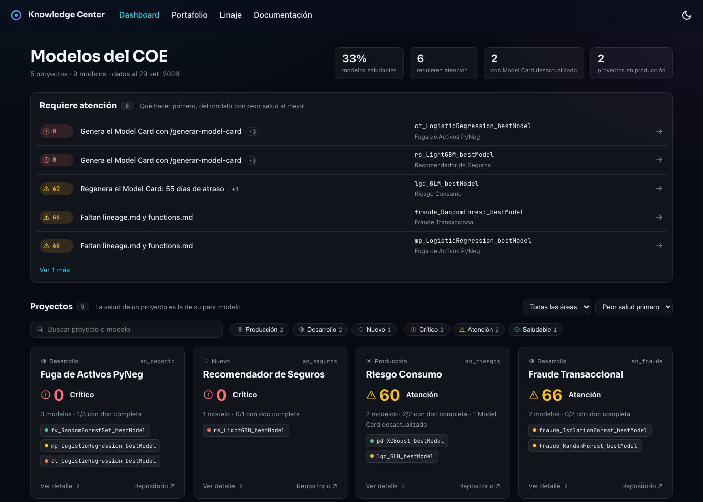
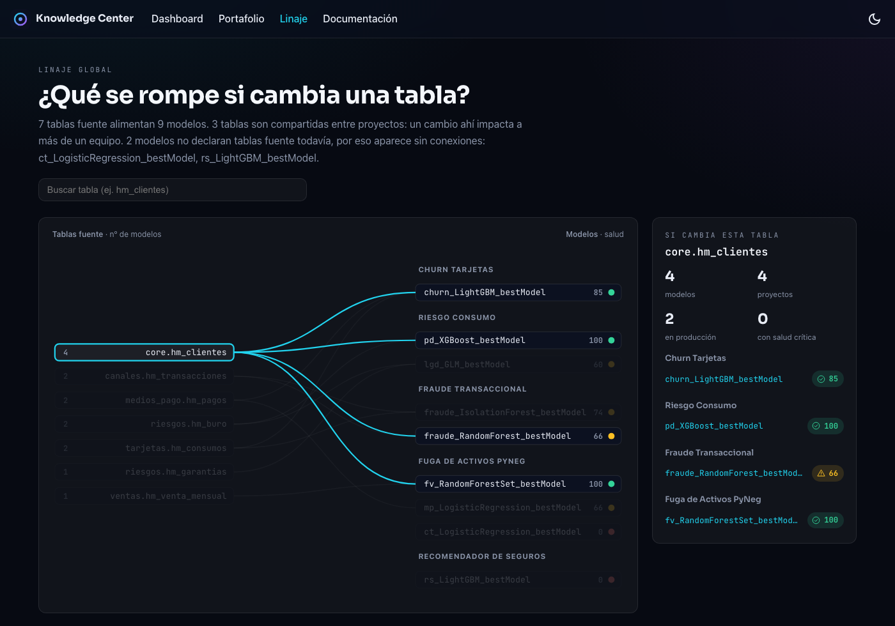
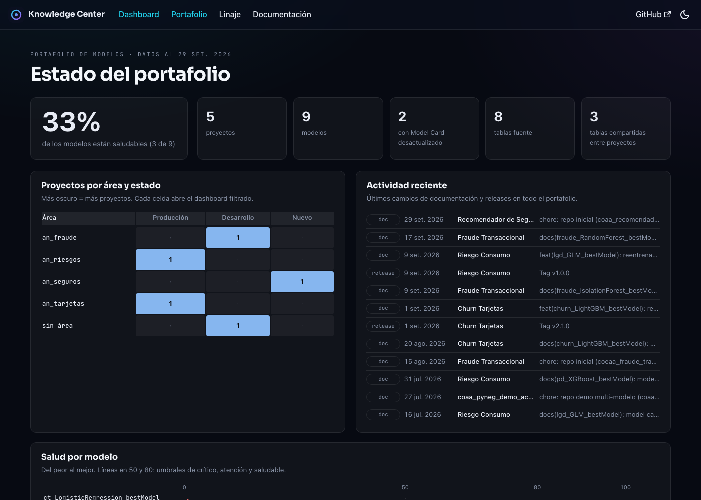
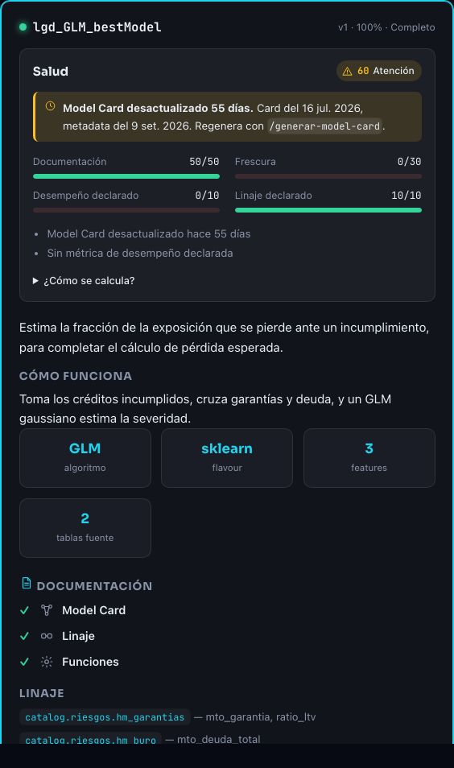
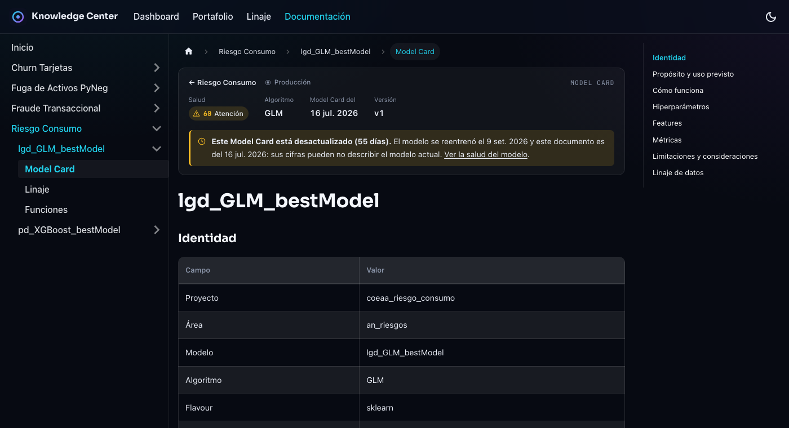
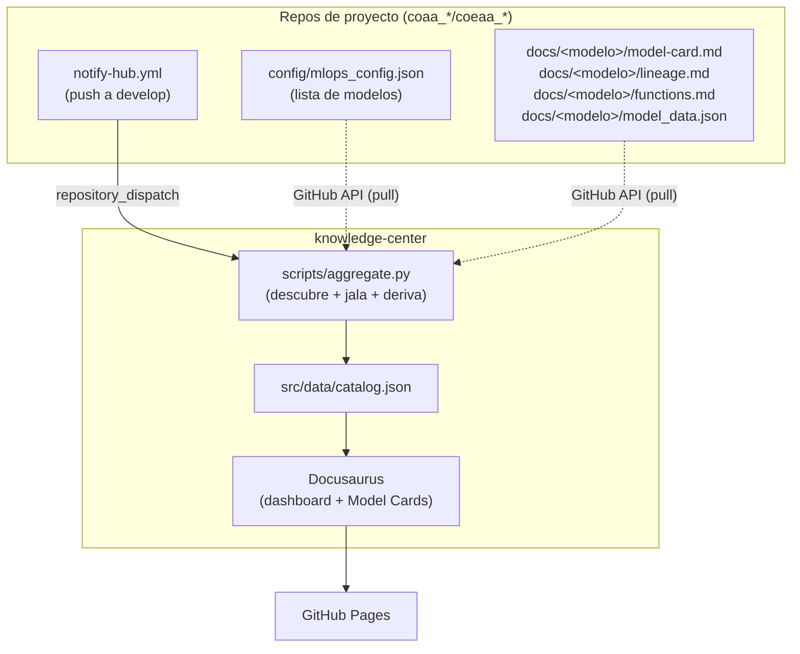

# Knowledge Center

**Gobierno de modelos sin fricción.** Descubre solo los repos de modelos del COE y, en cada build,
responde las tres preguntas de quien decide:

- **¿Qué documentación requiere revisión?** Un puntaje de salud documental explicable por modelo y la detección de
  **doc drift**: los metadatos tienen un commit posterior al Model Card.
- **¿Qué modelos dependen de una tabla?** Un linaje global con análisis de impacto entre proyectos.
- **¿Cómo está el portafolio?** Una vista para comité, imprimible a PDF.

Nada se llena a mano: todo se deriva de lo que ya está en los repos (sin base de datos).

**En vivo:** https://luxitoppsai.github.io/knowledge-center/

| Dashboard + "Requiere atención" | Linaje: impacto de una tabla |
| --- | --- |
|  |  |
| **Portafolio para comité** | **Salud y drift de un modelo** |
|  |  |
| **Model Card con su ficha** | |
|  | |

## Demo en 90 segundos

1. **(0:00) Dashboard.** "5 proyectos, 9 modelos, y solo el 33% está saludable." *Requiere
   atención* no lista problemas: dice **qué hacer**, en orden. Nadie tuvo que armar esa lista.
2. **(0:20) Clic en "Revisa el Model Card: 55 días de atraso".** Los metadatos de `lgd_GLM` tienen
   un commit del 9 de septiembre y su Model Card es del 16 de julio. El hub lo detectó comparando
   commits, y quien abre ese Model Card ve el aviso arriba, no se entera tarde.
3. **(0:40) Linaje → `core.hm_clientes`.** "Si esta tabla cambia, se afectan 4 modelos de 4
   proyectos y 2 están en producción." Ese es el análisis de impacto que hoy se hace con reuniones.
4. **(1:00) Portafolio.** La vista para comité: matriz área × estado, ranking de salud y actividad
   reciente. Se imprime a PDF tal cual.
5. **(1:15) El cierre.** Un issue en el dispatcher crea un repo nuevo, y minutos después aparece
   aquí solo. Cero pasos manuales entre piezas.

## La idea en un párrafo

Este repo **no almacena documentación**. Es una **vista computada**: en cada build, descubre los
repos de proyecto (por prefijo `coaa_*`/`coeaa_*`), lee lo que tienen *ahora mismo* (qué archivos
de doc existen por modelo, si tienen releases, qué dice cada `model_data.json`), arma el catálogo,
y publica. Nada se copia de forma permanente ni queda desactualizado — el build de mañana refleja
el estado de mañana. Ver [`RFC.md`](RFC.md) del proyecto para el contrato completo y la bitácora de
decisiones.

**Un repo es un proyecto, y un proyecto puede tener varios modelos.** `config/mlops_config.json`
(raíz del repo) lista los modelos; cada uno documenta por separado en `docs/<nombre_modelo>/`. El
`README.md` raíz describe el proyecto; cada `docs/<modelo>/model-card.md` describe un modelo.

## El ecosistema (4 repos)

| Repo | Rol | ¿Obligatorio? |
| --- | --- | --- |
| **`knowledge-center`** (este) | Agregación + dashboard + Pages | ✅ Sí — es el único que hace trabajo |
| [`knowledge-center-template`](https://github.com/luxitoppsai/knowledge-center-template) | Cookiecutter: de acá nace cada repo de proyecto | Conveniencia |
| [`knowledge-center-dispatcher`](https://github.com/luxitoppsai/knowledge-center-dispatcher) | Issue → repo nuevo | Conveniencia |
| [`knowledge-center-autodoc`](https://github.com/luxitoppsai/knowledge-center-autodoc) | Skill que genera el Model Card | Conveniencia |

Un repo de proyecto **no necesita código que "sepa" que el hub existe** — el acoplamiento es una
convención de nombre + archivos, no una dependencia fuerte. Ver [`setup/README.md`](./setup/README.md)
para el contrato exacto y cómo integrar un repo manualmente (sin pasar por el template).

## Arquitectura


```mermaid
graph TD
  subgraph "Repos de proyecto (coaa_*/coeaa_*)"
    CFG["config/mlops_config.json<br/>(lista de modelos)"]
    D["docs/&lt;modelo&gt;/model-card.md<br/>docs/&lt;modelo&gt;/lineage.md<br/>docs/&lt;modelo&gt;/functions.md<br/>docs/&lt;modelo&gt;/model_data.json"]
    N["notify-hub.yml<br/>(push a develop)"]
  end
  subgraph "knowledge-center"
    AGG["scripts/aggregate.py<br/>(descubre + jala + deriva)"]
    CAT["src/data/catalog.json"]
    SITE["Docusaurus<br/>(dashboard + Model Cards)"]
  end
  PAGES["GitHub Pages"]

  N -- "repository_dispatch" --> AGG
  CFG -. "GitHub API (pull)" .-> AGG
  D -. "GitHub API (pull)" .-> AGG
  AGG --> CAT --> SITE --> PAGES
```

- **Descubrimiento**: `aggregate.py` lista repos del owner vía `/user/repos` (incluye privados,
  necesita un PAT — el `GITHUB_TOKEN` efímero de Actions no alcanza para ver repos ajenos al propio).
- **4 disparadores** del rebuild (`.github/workflows/deploy.yml`): `repository_dispatch` (push real
  a un proyecto → casi instantáneo), `schedule` diario (red de seguridad), `workflow_dispatch`
  (manual), `push` a `main` de este repo (cuando editás el hub mismo).
- **Ver [`setup/README.md`](./setup/README.md)** para la tabla exacta de "de dónde sale cada dato"
  (completitud, estado, métricas, histórico) — no está escondido, está documentado con precisión.

## Estructura de este repo

```
knowledge-center/
  scripts/aggregate.py         # el corazón: descubre, jala, deriva el catálogo (salud y drift incluidos)
  tests/test_aggregate.py      # tests de las funciones puras; corren en CI antes de publicar
  plugins/project-pages/       # plugin Docusaurus: genera /proyecto/<slug> en build time
  src/
    pages/index.js             # dashboard (landing) + "Requiere atención"
    pages/linaje.js            # linaje global + análisis de impacto
    pages/portafolio.js        # vista de portafolio para comité
    lib/                       # lógica de presentación compartida: salud, estado, linaje, eventos
    components/Salud/          # badge y desglose de salud (medidores, motivos, drift)
    components/FichaModelo/    # ficha arriba de cada documento de un modelo
    components/EstadoTag/      # ciclo de vida en neutro (producción / desarrollo / nuevo)
    components/ProjectDetail/  # la página de detalle por proyecto
    components/Icon/           # set de iconos propio (sin librería)
    theme/DocItem/Content/     # wrap del tema: inserta la ficha sin tocar el markdown
    css/custom.css             # tokens de diseño (claro/oscuro/impresión), estados, rampa secuencial
    data/catalog.json          # versionado con placeholder vacío; el build real lo sobreescribe
  docs/intro.md                # única página de docs versionada — el resto (docs/<slug>/*) es
                               # temporal, se re-descarga en cada build (gitignored)
  specs/                       # RFCs en formato SDD (spec / plan / tasks)
  setup/                       # referencia para integrar un repo de proyecto (ver arriba)
  .github/workflows/deploy.yml # tests → agregación → build → Pages (4 disparadores)
```

## Salud documental y doc drift, en una tabla

| Componente | Puntos | Regla |
| --- | --- | --- |
| Documentación | 50 | % de docs esperados presentes (Model Card, linaje, funciones) × 0.5 |
| Frescura | 30 | 30 si el Model Card está al día · 15 con drift ≤ 30 días · 0 con más o sin card |
| Desempeño declarado | 10 | hay métrica (AUC) en `model_data.json` |
| Linaje declarado | 10 | `sources.table_list` tiene al menos una tabla |

**Saludable ≥ 80 · Atención 50–79 · Crítico < 50.** El proyecto toma la salud de su **peor**
modelo. **Doc drift** = el último commit a `docs/<modelo>/model_data.json` (huella del
entrenamiento) es más nuevo que el último commit a `docs/<modelo>/model-card.md`. Es una señal de posible desactualización, no evidencia de reentrenamiento. El puntaje mide
presencia documental y metadatos declarados, no calidad del contenido ni desempeño actual. Pesos y umbrales
viven en un solo lugar: `scripts/aggregate.py`. Contrato completo:
[`specs/RFC-002-gobierno-de-modelos/`](specs/RFC-002-gobierno-de-modelos/spec.md).

## Correrlo localmente

```bash
npm install
pip install requests pytest
pytest -q                        # tests del agregador (sin red ni token)

# 1. Agregar el catálogo real (necesita un token con acceso a tus repos coaa_*/coeaa_*)
export KC_OWNER=tu-usuario-github
export KC_PREFIXES="coaa_,coeaa_"   # opcional — es el default
python scripts/aggregate.py     # usa `gh auth token` si no exportás GITHUB_TOKEN

# 2. Levantar el sitio
npm start                        # dev server con hot-reload
# o
npm run build && npm run serve   # build de producción, servido local
```

Si no corrés el paso 1, el sitio igual compila (con `src/data/catalog.json` vacío) — el dashboard
muestra el mensaje de "aún no hay proyectos indexados".

## Diseño

Tema claro/oscuro (toggle en la navbar), tipografía Sora (títulos) + system-ui (cuerpo) +
JetBrains Mono (datos/labels). El gradiente de marca (cyan→índigo→violeta) está reservado a un solo
lugar — el botón CTA — a propósito: si aparece en todo, deja de significar algo. Ver la sección
"Diseño" de [`RFC.md`](RFC.md) para la auditoría UX/UI completa (qué se cambió y por qué).

## Contribuir

Ver [`CONTRIBUTING.md`](./CONTRIBUTING.md).

## Mejoras de experiencia (RFC-005)

La interfaz mantiene la identidad visual y presenta **salud documental /100**, con explicación
accesible, filtros rotulados y conteos explícitos de proyectos. Los motivos se despliegan por
clic, toque o teclado, y la guía de actualización permite copiar el comando del generador.

El dashboard ofrece tarjetas (hasta tres modelos visibles por proyecto) y tabla, con filtros y
vista compartibles por URL. Los KPI llevan al ranking de modelos, a pendientes, a documentos por
revisar o a proyectos en producción. El portafolio presenta primero el ranking, cinco eventos
expandibles, leyenda numérica de la matriz y **Imprimir / Guardar PDF**. El linaje conserva los
nombres completos en el panel de impacto y permite limpiar la selección.

En cada agregación, el Model Card presenta propósito, funcionamiento, métricas y limitaciones
antes de la identidad técnica, conservando contenido y encabezados. El repositorio fuente y sus
fechas de commits no se modifican. Ver [RFC-005](specs/RFC-005-claridad-y-exploracion/spec.md) y
[verificación local reproducible](CONTRIBUTING.md#verificación-de-ux-sin-github-rfc-005).

Las capturas de la tabla inicial ilustran la demo anterior a RFC-005.
