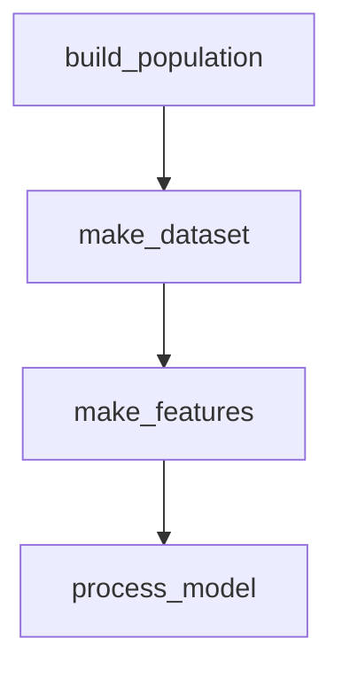

# Vistazo de funciones

Cómo interactúan los pasos del pipeline.

| Paso | Qué hace |
| --- | --- |
| `build_population` | ... |
| `make_dataset` | ... |
| `make_features` | ... |
| `process_model` | ... |
