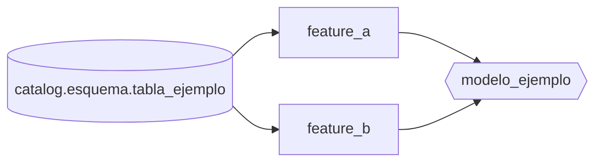

# Linaje de consumo de datos

Diagrama de qué tablas alimentan cada feature del modelo (Mermaid — Docusaurus lo renderiza nativo).

## Tablas fuente

| Tabla | Columnas consumidas |
| --- | --- |
| `catalog.esquema.tabla_ejemplo` | feature_a, feature_b |
